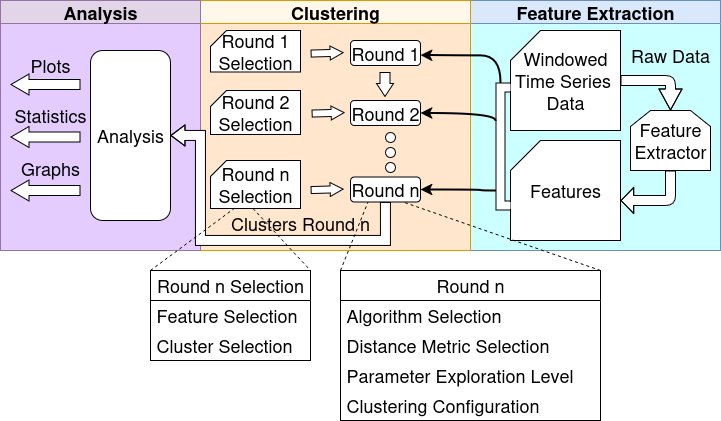

# CLUE

This is a WIP proof of concept implementation of a cluster-based exploration framework (**CLUE**). This implementation is primarily based on the thesis found [here](https://gupea.ub.gu.se/handle/2077/89783).

## Installation

To run this, clone the github repo and install the requirements.

```bash
git clone https://github.com/rasmusthorsson/CLUE
cd CLUE
pip install -r requirements.txt
```

**CLUE** also requires JRE (Java Runtime Environment) in order to run the clustering sub-system which is implemented in Java currently.

## CLUE-CORE

**CLUE** is split into two parts, the core part (**CLUE-CORE**) and the clustering part (**CLUE-CLUST**). **CLUE-CORE** manages the input pre-processing, output generation and plotting, joining of rounds, and other logic. **CLUE-CLUST** performs the clustering. Below is a figure of the core framework.



### Input

The user supplies the input as a single csv file, where each row in the file represents one point in the n-dimensional space. Each row should have n+1 columns, where the first column is a unique ID and the rest n columns are values for each dimension. The first row should contain headers for the columns. **IMPORTANT: The first column header *MUST* be 'ID'**, the rest of the column headers are less strict, but each header must be unique. See the example input file [here](input.csv) for an example.

### Feature Extraction

Features are extracted from the raw data (Windowed Time Series Data in the figure). These features are pre-defined and a list of available features will be available later. The features are collected in a features base file which makes up the second part of the input to the clustering stage, the first part being the raw data itself.

### Clustering Stage

The clustering is split into rounds, each round selects whether to cluster on the raw data or the base features generated in the previous stage. Each round also has two selections associated with it, feature selection and cluster selection (see below). Plots are generated after each round to aid the user in identifying interesting clusters to examine further, allowing for an interactive exploration of the data. 

#### Feature Selection

Feature selection allows dimension/feature selection, depending on whether the round clusters on the raw data or on the extracted features. Feature selection is done by adding a csv file with the names of the features in the first row.

#### Cluster Selection

Cluster selection allows filtering of clusters from the previous round in order to aid exploration efforts. For example if the first round results in two clusters, the second round can select to only use data points from one of the clusters as input. This is done by adding a file detailing which clusters to use. Here is an example sh**owing the available formats, each format is optional.

```
IN:1,5,6 
NOTIN:2,3
ABOVE:1000
BELOW:5000
```

The first row specifies that only clusters 1, 5, and 6 are to be considered. The second row specified that clusters 2 and 3 are not to be considered. The third row specifies that only clusters with a size above 1000 should be considered. The fourth row specifies that only clusters with a size below 5000 should be considered. **The implementation for this is not complete, it is probably best to only use one of these rows for the cluster selection file per round currently**

#### Round Options

Furthermore, each round is associated with a set of options, these options range from clustering parameters to which clustering algorithm to use. Most of these options are directly forwarded to the **CLUE-CLUST**.

- `Use Features` (Cluster on the features base file instead of the raw data)
- `Standardize` (Standardizes the data, primarily used in combination with Use Features to avoid one or two features dominating the clustering)
- `Algorithm Selection`:  DBSCAN, IP.LSH.DBSCAN, K-Means
- `Distance Metrics`: Euclidean, Angular, DTW
- `Parameter Exploration`: None, K-Distance, Grid Search
- `Epsilon` (Parameter for DBSCAN and IP.LSH.DBSCAN)
- `MinPts` (Parameter for DBSCAN and IP.LSH.DBSCAN)
- `Hyperplanes` (Parameter for IP.LSH.DBSCAN)
- `Hashtables` (Parameter for IP.LSH.DBSCAN)
- `KClusters` (Parameter for K-Means)
- `Threads` (Numbers of threads to use when possible)

### Analysis Stage

When the final round has completed, the final plots and graphs are generated, these are (optionally) more extensive than the ones generated during the clustering stage. 

## CLUE-CLUST

**CLUE-CLUST** manages individual clustering of rounds and is managed as a .jar file. It can be used separately if desired, but for this project it is used as the clustering subsystem for each round. **CLUE-CLUST**.
